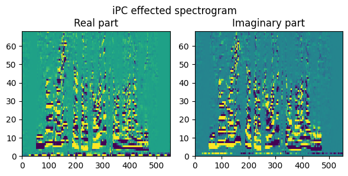
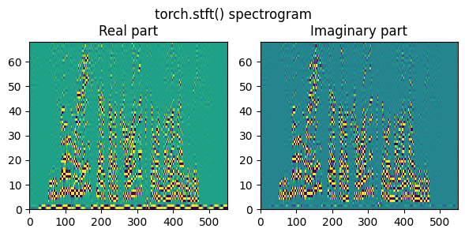
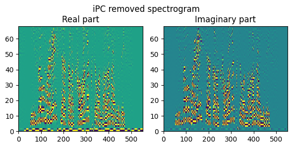

# ipcSTFT: Unofficial torch.stft() based implementation of "[instantaneous Phase Correction STFT](http://contents.acoust.ias.sci.waseda.ac.jp/publications/IEEE/2018/icassp-yatabe2-2018apr.pdf)"

In this repository, we provide an unofficial implementation of instantaneous Phase Correction STFT (ipcSTFT) [1,2]. The official implementation is available at [here](https://codeocean.com/capsule/1906064/tree/v1) (MATLAB based). The implementation is based on `torch.stft()` and `torch.istft()` in PyTorch. This implementation is independent of the official implementation by the authors and is not guaranteed to work exactly the same.

## Requirements (tested environment: on Ubuntu 20.04)
- only ipcSTFT
    - Python 3 (3.8.10)
    - PyTorch (2.1.0+cu118)
- execution of example
    - torchaudio (2.1.0+cu118)
    - matplotlib (3.6.0)
    - numpy (1.22.4)


## Example
See `usage.ipynb` and `LowRank_modeling.ipynb` [2] for details. Used audio sample is from JSUT corpus [3].

```python
from src.STFT import ipcSTFT

stft = ipcSTFT(
    n_fft=512,
    hop_length=128,
    win_length=512
) # arguments are the same as torch.stft()

sample_rate, t, torch.pi = 16000, torch.linspace(0, 1, sample_rate), torch.acos(torch.zeros(1)).item() * 2
waveform = torch.sin(2 * torch.pi * 200 * t)
spec, inv_operator = stft.stft(waveform) # get ipc effected spectrogram and inverse operator
spec_del_ipceffect = spec * inv_operator # remove ipc effect
waveform = stft.istft(spec, inv_operator)
waveform = stft.istft(spec_del_ipceffect, None)
```
  
  
  

## Similar Projects
- [MATLAB based official implementation](https://codeocean.com/capsule/1906064/tree/v1) (by the authors of the paper, MIT License)
- [TensorFlow based implementation](https://github.com/StephLin/wipctv/tree/master) (by StephLin, Apache License 2.0)

## Reference
[1] K. Yatabe and Y. Oikawa, "Phase corrected total variation for audio signals," _Proc. of IEEE International Conference on Acoustics, Speech and Signal Processing (ICASSP)_, 2018.  
[2] Y. Masuyama, K. Yatabe and Y. Oikawa, "Low-rankness of Complex-valued Spectrogram and Its Application to Phase-aware Audio Processing," _Proc. of IEEE International Conference on Acoustics, Speech and Signal Processing (ICASSP)_, 2019.  
[3] R. Sonobe, S. Takamichi and H. Saruwatari, "JSUT corpus: free large-scale Japanese speech corpus for end-to-end speech synthesis," _arXiv preprint (1711.00354)_, 2017.